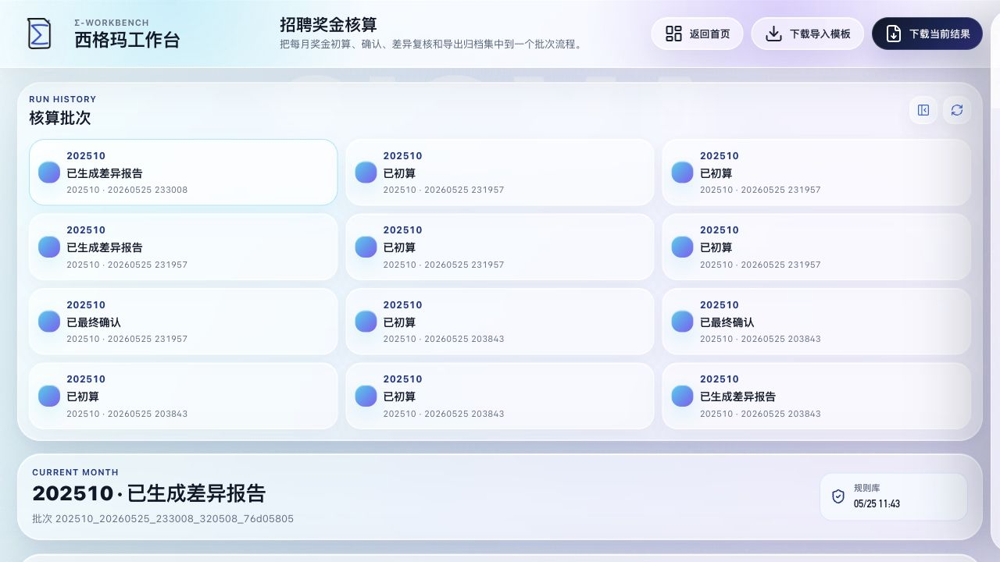
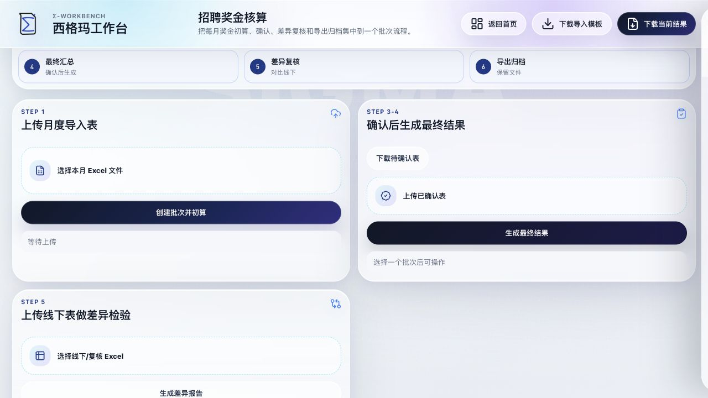
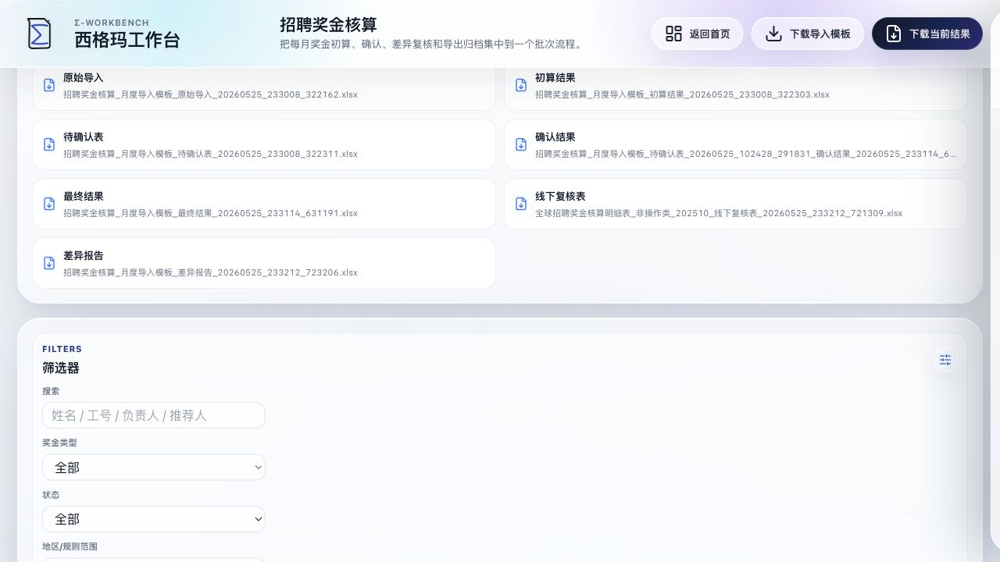
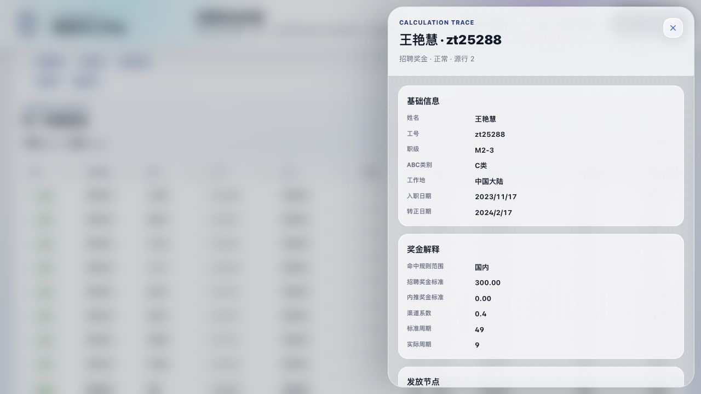

# 招聘奖金核算平台 SOP（薪酬专员版）

适用对象：负责招聘奖金、内推奖金核算与复核的薪酬专员

适用场景：按月完成招聘奖金初算、人工确认、差异复核、结果导出和归档

## 1. 这套平台是干什么的

这套平台用于把每月招聘奖金核算集中到一个批次里完成，核心能力包括：

- 上传月度导入表，自动生成核算批次
- 按规则库完成招聘奖金和内推奖金初算
- 生成待确认表，支持人工判断后再出最终结果
- 上传线下复核表，自动生成差异报告
- 保留每次核算的原始导入、初算结果、最终结果和差异报告，方便追溯

## 2. 你每月要准备什么

正式开始前，通常只需要准备 3 类文件：

1. 月度导入表
   要求为 Excel 文件，且必须包含 `导入_月度数据` 工作表。
2. 待确认表
   只有当平台初算后出现“待确认”记录时才需要。这个文件必须从平台下载后再填写。
3. 线下复核表
   用于和平台结果做差异比对。通常是你们现有的线下核算表或复核表。

## 3. 页面怎么看

页面可以理解为 4 个区域：

- 左上和中上：核算批次区，用来查看历史月份/历史批次
- 中部流程条：提示当前流程走到哪一步
- 中部操作卡片：上传月度表、上传确认表、上传线下复核表
- 下部明细区：查看明细、筛选异常、定位待确认或差异记录

建议做法：

- 新月份核算时，先新建批次
- 已经做过的月份，优先点开对应历史批次继续处理，不要重复新建

## 4. 标准月度操作流程

### 第一步：上传月度导入表并初算

操作步骤：

1. 点击“选择本月 Excel 文件”
2. 选择月度导入表
3. 点击“创建批次并初算”
4. 等待页面生成结果

完成后你会看到：

- 左侧新增一个核算批次
- 页面中间出现核算月份、导入行数、招聘奖金、内推奖金、待确认、异常条数
- 页面下方出现本批次的明细数据

你重点先看 3 个指标：

- `待确认`
  大于 0，说明有记录需要人工判断
- `异常条数`
  大于 0，说明有记录需要优先排查
- `招聘奖金 / 内推奖金`
  用于快速确认本月总额是否大体合理

### 第二步：判断是否需要下载待确认表

如果 `待确认 = 0`：

- 说明本批次没有必须人工判断的记录
- 可以直接使用“初算结果”继续复核
- 如有需要，再做线下差异比对

如果 `待确认 > 0`：

- 点击“下载待确认表”
- 在线下完成人工判断后，再回到平台上传确认结果

待确认表中，你主要填写这几列：

- `人工确认结果`
- `人工确认金额`
- `不发/暂缓原因`

其中 `人工确认结果` 的下拉值为：

- `确认发放`
- `不发放`
- `暂缓`

填写原则建议：

- 能正常发放的，填 `确认发放`
- 明确不发的，填 `不发放`
- 暂时不能定论、需要延后处理的，填 `暂缓`
- 若发放金额要调整，在 `人工确认金额` 填最终金额

### 第三步：上传已确认表，生成最终结果

当你完成待确认表判断后：

1. 在“确认后生成最终结果”区域点击“上传已确认表”
2. 选择刚刚填写完成的确认文件
3. 点击“生成最终结果”

系统生成后：

- 批次状态会更新
- 文件区会新增 `最终结果`
- 最终结果中会形成 `最终招聘奖金汇总` 和 `最终内推奖金汇总`

使用建议：

- 对外发放或正式归档时，优先使用 `最终结果`
- `初算结果` 只适合内部测算、复核前检查或无待确认场景

### 第四步：上传线下复核表，生成差异报告

当你需要把平台结果与线下口径做比对时：

1. 在“上传线下表做差异检验”区域上传线下复核表
2. 点击“生成差异报告”
3. 等待系统输出差异文件

适用时机：

- 想验证平台结果和线下表是否一致
- 想快速定位汇总差异、明细差异
- 月度上线初期，需要双轨复核

差异报告生成后，建议先看：

- 招聘汇总差异
- 内推汇总差异
- 招聘明细差异
- 内推明细差异

## 5. 文件区怎么用

一个完整批次里，常见文件含义如下：

- `原始导入`
  你上传的源文件，留作追溯
- `初算结果`
  平台按规则库直接跑出的第一版结果
- `待确认表`
  需要人工判断时下载填写
- `确认结果`
  你上传回平台的已处理待确认表
- `最终结果`
  结合人工确认后的正式结果
- `线下复核表`
  你上传的线下核算或复核文件
- `差异报告`
  平台与线下结果的比对输出

建议归档口径：

- 没有待确认的月份：至少保留 `原始导入`、`初算结果`、`差异报告（如有）`
- 有待确认的月份：至少保留 `原始导入`、`待确认表`、`确认结果`、`最终结果`、`差异报告（如有）`

## 6. 怎么快速找异常、待确认和差异

明细区支持筛选，建议你优先使用这几种方式：

- 在搜索框输入 `姓名 / 工号 / 负责人 / 推荐人`
- 按 `奖金类型` 区分招聘奖金和内推奖金
- 按 `状态` 查 `待确认`、`异常`、`差异`
- 用快捷按钮直接筛选：
  `只看待确认`、`只看异常`、`只看有金额`、`只看差异`

实操建议：

- 初算后先点 `只看待确认`
- 再点 `只看异常`
- 做线下比对后再点 `只看差异`

这样效率最高。

## 7. 怎么看单条记录的计算说明

在明细表里点击任意一行，右侧会打开“Calculation Trace / 计算解释”。

这里通常能看到：

- 基础信息
  如姓名、工号、职级、ABC 类别、工作地
- 奖金解释
  如规则范围、奖金标准、渠道系数、周期等
- 发放节点
  如入职 1 月、3 月、6 月、转正等

适合用来回答这类问题：

- 这笔奖金为什么有 / 为什么没有？
- 为什么这条记录进入待确认？
- 为什么金额和我线下算的不一致？

如果一条记录金额异常，建议先打开这里看说明，再决定是修规则、修源数据，还是走人工确认。

## 8. 小白最容易出错的地方

### 1. 直接拿别的 Excel 当待确认表上传

不可以。

确认结果文件必须来自平台下载的 `待确认表`，并且保留 `待确认_发放判断` 工作表。

### 2. 月度导入表 sheet 名不对

如果导入文件里没有 `导入_月度数据` 工作表，平台无法初算。

### 3. 有待确认记录，但没有生成最终结果就直接归档

如果本月存在待确认，建议一定先上传已确认表并生成 `最终结果`，再作为正式版本归档。

### 4. 差异复核时拿错版本对比

建议口径统一：

- 未做人工确认前，可用 `初算结果` 对比
- 已做人工确认后，优先用 `最终结果` 对比

### 5. 重复新建批次，导致同一个月出现很多版本

同一月份如果已经有批次，优先点开已有批次继续处理。只有在你明确要重跑一版时，才重新创建新批次。

## 9. 建议你的月度工作顺序

给薪酬专员的推荐顺序如下：

1. 上传月度导入表并初算
2. 先看待确认和异常条数
3. 下载并处理待确认表
4. 上传确认结果，生成最终结果
5. 上传线下复核表，生成差异报告
6. 下载并归档本批次关键文件

## 10. 一句话记忆版

先初算，再处理待确认，再出最终结果，最后做差异复核和归档。
